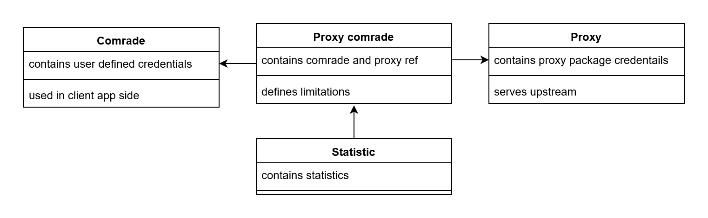

# Big Brother is watching you

# Description

## About the project

...

## Features

...

# Setup

There are two ways to set up application:

## From current environmental

### Requirements

- [Python 3.8+](https://www.python.org/downloads/)
- [Poetry 1.1.10+](https://python-poetry.org)

### Steps

- cd src/python/src
- install project dependencies by command
  ```
  poetry install
  ```

- copy .env.example to .env and set variables (see below section [Global environmental](#global-environmental))
- run bbc server
  ``` 
  python bbc_server.py
  ```

## With Docker

### Requirements

- [Docker 20.10.0+](https://hub.docker.com)
- [Docker compose 1.28.0+](https://docs.docker.com/compose/)

### Steps

- copy .env.example to .env and set variables (see below section [Global environmental](#global-environmental))
- from project root directory up container
  ```
  docker-compose up -d
  ```
- wait for a message `'setup.py' finished` in the logs

# Usage

Fill database tables(see [cli](#cli)):

1. Add user profile to comrade table. Use script encode_my_password.py to hash the password.
2. Add proxy credentials to proxy_credentials table. Use script encode_my_password.py to hash the password.
3. Add relationships between proxy and comrades to proxy_comrades table. Set bandwidth and threads limits.

Send test request like:

```
  curl --proxy 127.0.0.1:8081 --proxy-user test:test1 -k -p https://ident.me 
```

Note: `Proxy-Authorization` header must be included if proxy has authorization

# Global environmental

Before start bbc global variables must be defined. Some of them required:

- SALT_KEY - salt for password algorithm hashing
- LISTEN_PORT - port in range [0, 65535], which bbc will listen. Default 8081

Others are optional:

- LOG_LEVEL - level of logging. Default INFO
- STATISTIC_LOGGING_TIME_TRIGGER - interval logging statistic to database. Available values: EVERY_MINUTE,
  EVERY_FIVE_MINUTES, EVERY_FIFTEEN_MINUTES, EVERY_THIRTY_MINUTES, EVERY_HOUR, EVERY_TWELVE_HOUR, DAILY, WEEKLY,
  MONTHLY, ANNUALLY. Default EVERY_HOUR
- DB_PREPARING_ENABLED - flag, which responds to create the default sqlite database locally if credentials are not valid
  (see section [Database](#database)). Default True
- DB_DRIVER - database driver. Available values: mysql, sqlite
- DB_HOST - database host
- DB_PORT - database port
- DB_USERNAME - database username
- DB_PASSWORD - database password
- DB_DATABASE - schema name

# Database

Big brother is designed to use a sqlite dbms. ~~(This feature is in development) But you can also use mysql dbms~~.

For sqlite dbms you need set only DB_DRIVER=sqlite and DB_DATABASE.

If given credentials are not valid and DB_PREPARING_ENABLED=True, then autogenerated.db will create.

Database migrations apply automatically everytime when bbc starts.

## Tables

<details>
<summary>Comrades - stored user profiles</summary>

- name - optional label, which described user entity
- username - unique profile name
- password - profile hash of password based on SALT_KEY
- description - optional text, which described user entity

</details>
<details>
<summary>Proxy credentials - stored proxy credentials</summary>

- type - type of proxy. Available options: geoserf1, geoserf5, geoserf15
- protocol - http or https protocol, which proxy supported
- host - proxy host
- port - proxy port
- username - proxy username
- password - proxy hash of password based on SALT_KEY
- description - optional text, which described proxy entity
- ~~options~~

</details>
<details>
<summary> Proxy comrades - stored relationships between proxy and credentials, sets limits </summary>

- proxy_credential_id - proxy credential id
- comrade_id - comrade id
- bandwidth_limit_b - bandwidth limit in bytes
- concurrency_threads_limit - concurrency threads limit
- used_bandwidth_b - used bandwidth in bytes
- rotate_strategy - rotate strategy. Available options
    - NO_ROTATE = 0
    - FORCE_ROTATE = 1
    - ON_BAD_HTTP_STATUS_ROTATE = 2

</details>
<details>
<summary>Statistics - stored proxy usage statistics based on triggers</summary>

- proxy_comrade_limit_id - proxy comrade id
- from_timestamp - timestamp for the start of statistics collection
- to_timestamp - timestamp for the end of statistics collection
- trigger - trigger, which trigger logging
- ~~number_of_requests - number of requests within interval~~
- upload_traffic_bytes - amount of upload traffic in bytes within interval
- download_traffic_bytes - amount of download traffic in bytes within interval
- total_traffic_bytes - amount of total traffic in bytes within interval
- ~~number_of_responses~~

</details>

## Visualisation



## CLI

Available cli commands, which now only helps interactions with db. Further will be reworked.
<details>
<summary>Use `--help`  command for details</summary>
<pre>python bbcli.py --help</pre>
</details>

## Custom status codes

If something was wrong in bb side, you will get custom http code.
Below describes meaning of each:
1. 449 - Unknown error. It means that unexpected error was happened, and you should check logs.
2. 460 - `Proxy-Authorization` header is empty
3. 461 - Cannot identify comrade. Not found comrade with username
4. 463 - Identification comrade failed. Timeout exceed.
5. 464 - Authentication comrade failed.
6. 470 - Proxy usage bandwidth exceed. In the next moment proxy will be removed from local cache and marked in db as used.
7. 471 - Proxy usage thread exceed. In this case you have to decrease number of threads, which use single comrade. If you seldom get this status code, then just retry request without any changes.

# Notes

- all passwords stored at database are encrypted. 
- restriction: username for comrades must be unique
